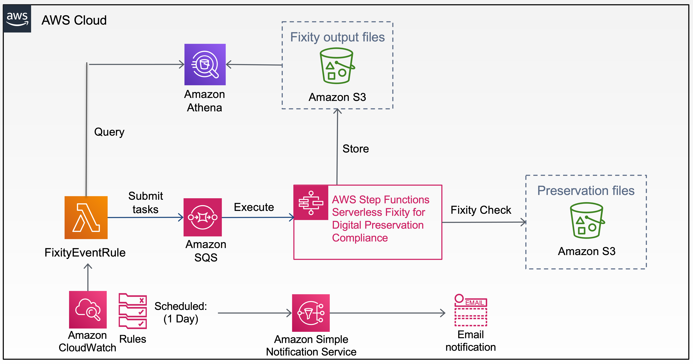

# FixityEventRule

This project contains one Lambda function [lambda_function.py](fixitycheck/lambda_function.py) that queries Athena table and execute Step functions tasks and a CloudWatch rule that triggers a Lambda function [sns.py](fixitycheck/sns.py) to email recipient with fixity report. Source code and supporting files for this serverless application - FixityEventRule - that you can deploy with the SAM CLI or Cloudformation. It includes the following files and folders.

- fixitycheck - Code for this application's Lambda function.
- events - Invocation events that you can use to invoke the function.
- tests - Unit tests for this application code.
- template.yaml - A template that defines this application's AWS resources.

The application uses several AWS resources, including Lambda functions, Athena, AWS SNS, CloudWatch, and Step Functions. These resources are defined in the `template.yaml` file in this project.

## Architecure Overview



### Fixity Check:
1. Cloudwatch executes FixityEventRule Lambda function daily.
2. FixityEventRule queries Athena, generate step functions tasks, and executes step functions.
3. Step functions do fixity checks for the preservation files stores in S3 and store fixity check results to S3.

### Email fixity report:
1. Cloudwatch executes FixityEventRule Lambda function daily.
2. FixityEventRule queries Athena, generate summary report, and email to recipient through SNS.

See [DLP Fixity Service](https://github.com/vt-digital-libraries-platform/FixityService) for the detail implementation of the AWS step functions serverless fixity for digital preservation compliance.

See [Athena](athena/readme.md) for Athena database setup.

## Deploy the FixityEventRule application

### Deploy FixityEventRule application using CloudFormation stack
#### Step 1: Launch CloudFormation stack
[](https://console.aws.amazon.com/cloudformation/home?region=us-east-1#/stacks/new?&templateURL=https://vtdlp-dev-cf.s3.amazonaws.com/ef4ecb7ebe86dae6f577b24a635a3e46.template)

Click *Next* to continue

#### Step 2: Specify stack details

| Name | Description |
|:---  |:------------|
| Stack name | any valid name |
| DatabaseName | Athena Database Name |
| TableName | Athena Table Name |
| ResultBucket | S3 Bucket that stores Athena query result |
| FixityOutputBucket | S3 Bucket that stores Fixity output result |
| StateMachineName | a valid State Machine Name |
| WorkGroupName | a valid Athena WorkGroup Name |
| SNSTopic | a valid SNS Topic Name |
| GlueManagedPolicyName | Glue ManagedPolicy Name |
| Email | a valid email |
| DayPeriod | 90 |
| REGION | a valid AWS region. e.g. us-east-1  |

#### Step 3: Configure stack options
Leave it as is and click **Next**

#### Step 4: Review
Make sure all checkboxes under Capabilities section are **CHECKED**

Click *Create stack*


### Deploy FixityEventRule application using SAM CLI

To use the SAM CLI, you need the following tools.

* SAM CLI - [Install the SAM CLI](https://docs.aws.amazon.com/serverless-application-model/latest/developerguide/serverless-sam-cli-install.html)
* [Python 3 installed](https://www.python.org/downloads/)
* Docker - [Install Docker community edition](https://hub.docker.com/search/?type=edition&offering=community)

To build and deploy your application for the first time, run the following in your shell:

```bash
sam build --use-container
```
Above command will build the source of the application. The SAM CLI installs dependencies defined in `requirements.txt`, creates a deployment package, and saves it in the `.aws-sam/build` folder.

To package the application, run the following in your shell:
```bash
sam package --output-template-file packaged.yaml --s3-bucket BUCKETNAME
```
Above command will package the application and upload it to the S3 bucket you specified.

Run the following in your shell to deploy the application to AWS:
```bash
sam deploy --template-file packaged.yaml --stack-name STACKNAME --s3-bucket BUCKETNAME --parameter-overrides 'DatabaseName=databasename TableName=tablename ResultBucket=bucketname FixityOutputBucket=bucketname StateMachineName=statemachinename WorkGroupName=workgroupname SNSTopic=SNSTopic GlueManagedPolicyName=PolicyName Email=Email DayPeriod=90 Region=us-east-1' --capabilities CAPABILITY_IAM CAPABILITY_NAMED_IAM --region us-east-1
```

### Environment variables

| Key | Value |
|----------|:-------------:|
| DatabaseName | Athena Database Name |
| TableName | Athena Table Name |
| ResultBucket | S3 Bucket that stores Athena query result |
| FixityOutputBucket | S3 Bucket that stores Fixity output result |
| StateMachineName | State Machine Name |
| WorkGroupName | Athena WorkGroup Name |
| SNSTopic | SNS Topic Name |
| GlueManagedPolicyName | Glue ManagedPolicy Name |
| Email | email |
| DayPeriod | 90 |
| REGION | us-east-1 |

* **Stack Name**: The name of the stack to deploy to CloudFormation. This should be unique to your account and region, and a good starting point would be something matching your project name.
* **AWS Region**: The AWS region you want to deploy your app to.

## Run the lamdba function through bash

```bash
aws lambda invoke --function-name LambdaFunctioName out --log-type Tail --query 'LogResult' --output text |  base64 -d
```

## Unit tests

Tests are defined in the `tests` folder in this project. Use PIP to install the [pytest](https://docs.pytest.org/en/latest/) and run unit tests.

```bash
FixityEventRule$ pip install pytest pytest-mock --user
FixityEventRule$ python -m pytest tests/ -v
```

## Cleanup

To delete the sample application that you created, use the AWS CLI. Assuming you used your project name for the stack name, you can run the following:

```bash
aws cloudformation delete-stack --stack-name FixityEventRule
```
